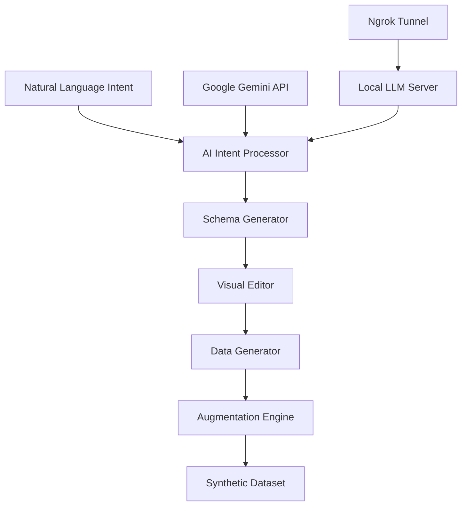

# 🤖 Synthetic Data on Demand

> **Revolutionizing Data Generation with AI-Powered Intelligence**

<div align="center">

[](https://your-app-url.streamlit.app)
[](https://www.python.org/downloads/)
[](https://opensource.org/licenses/MIT)

*Transform your data requirements into production-ready synthetic datasets with zero coding required*

</div>

---

## 🌟 **What Makes SDoD Revolutionary?**

SDoD isn't just another data generation tool—it's an **intelligent synthetic data platform** that combines cutting-edge AI with intuitive design to solve the most challenging data problems in modern software development.

### 🎯 **The Problem We Solve**
- **Privacy Regulations**: GDPR, CCPA making real data unusable
- **Data Scarcity**: Limited or biased datasets hampering ML projects  
- **Development Bottlenecks**: Waiting months for sanitized production data
- **Testing Complexity**: Need realistic data that covers edge cases
- **Compliance Overhead**: Legal reviews for every data transfer

### ⚡ **Our Solution**
**Intelligent, contextual synthetic data generation powered by enterprise-grade AI**

---

## 🚀 **Core Features**

### 📝 **Intent-Driven Architecture**
- **Natural Language Processing**: Describe your data needs in plain English
- **Domain Intelligence**: AI understands business context and industry patterns
- **Requirement Analysis**: Automated extraction of technical specifications

### 🏗️ **AI-Powered Schema Generation**
- **Google Gemini Integration**: Leverages state-of-the-art language models
- **Local LLM Support**: Privacy-first option with your own models
- **Business Logic Inference**: Automatically detects relationships and constraints
- **Industry Templates**: Pre-built schemas for common business domains

### ✏️ **Visual Schema Editor**
- **Interactive Relationship Mapping**: Drag-and-drop schema visualization
- **Real-time Validation**: Instant feedback on schema integrity
- **Constraint Management**: Foreign keys, data types, and business rules
- **Export Capabilities**: Generate DDL scripts for any database

### 🎲 **Intelligent Data Generation**
- **Context-Aware Synthesis**: Data that respects business logic and relationships
- **Scalable Architecture**: Generate thousands to millions of records
- **Quality Assurance**: Built-in validation and consistency checks
- **Performance Optimized**: Efficient generation algorithms

### 🔬 **Advanced Data Augmentation**
- **Pattern Enhancement**: Amplify existing data patterns
- **Anomaly Injection**: Controlled edge case generation
- **Bias Correction**: Algorithmic fairness improvements
- **Statistical Preservation**: Maintain original data distributions

---

## 🎭 **Technical Architecture**



### 🧠 **AI Backend Flexibility**

| Backend | Use Case | Performance | Privacy |
|---------|----------|-------------|---------|
| **Google Gemini** | Production workloads | ⚡⚡⚡ Ultra-fast | 🌐 Cloud-based |
| **Local LLM** | Sensitive data | ⚡⚡ Fast | 🔒 On-premises |
| **Ngrok Tunnel** | Hybrid deployment | ⚡⚡ Fast | 🔒 Local with cloud access |

---

## 🚀 **Quick Start**

### 💻 **Local Development**

```bash
# Clone the repository
git clone https://github.com/your-org/sdod.git
cd sdod

# Install dependencies
pip install -r requirements.txt

# Launch the application
streamlit run sdod.py
```

### ☁️ **Cloud Deployment**

**Streamlit Cloud**: One-click deployment - simply connect your GitHub repository!

[](https://share.streamlit.io/)

---

## 🎯 **User Journey**

### 1️⃣ **Define Your Intent**
```
"I need customer transaction data for an e-commerce analytics dashboard 
covering the last 2 years with seasonal patterns and multiple payment methods"
```

### 2️⃣ **AI Schema Generation**
- Automatically creates `customers`, `orders`, `products`, `payments` tables
- Infers relationships and foreign keys
- Suggests appropriate data types and constraints

### 3️⃣ **Visual Refinement**
- Interactive ER diagram editing
- Real-time relationship validation
- Custom business rule injection

### 4️⃣ **Intelligent Generation**
- Context-aware data synthesis
- Realistic value distributions
- Temporal pattern preservation

### 5️⃣ **Quality Augmentation**
- Statistical enhancement
- Edge case generation
- Export to multiple formats (CSV, JSON, SQL, Parquet)

---

## 🔧 **Configuration**

### 🌐 **AI Backend Setup**

#### Google Gemini API
```bash
# Get your API key from Google AI Studio
# Enter in the sidebar: Google Gemini API Key
```

#### Local LLM Server
```bash
# Local network access
http://192.168.1.16:1234

# Public access via Ngrok
https://abc123.ngrok.io
```

### 🛡️ **Ngrok Integration**
For **Streamlit Cloud** deployment with local LLM servers:

```bash
# Start your local LLM (e.g., LM Studio)
lmstudio-server --port 1234

# Create secure tunnel
ngrok http 1234

# Use the https URL in SDoD
```

**Automatic ngrok optimization**: SDoD detects ngrok URLs and applies bypass headers for seamless operation.

---

## 🎨 **Customization**

### 🖼️ **Branding**
- Replace `assets/img/NWorks-logo.png` with your logo
- Automatic fallback to text-based branding

### 🔧 **Advanced Configuration**
- Custom LLM model selection
- Token limit optimization
- Generation batch sizes
- Export format preferences

---

## 🏢 **Enterprise Features**

- **🔒 Privacy-First**: No data persistence, session-based processing
- **⚡ High Performance**: Optimized for large-scale generation
- **🌍 Multi-Cloud**: Deploy anywhere with container support
- **📊 Analytics Ready**: Direct integration with BI tools
- **🔄 API-First**: Extensible architecture for custom integrations

---

## 🤝 **Contributing**

We welcome contributions! See our [Contributing Guide](CONTRIBUTING.md) for details.

### 🛠️ **Development Setup**
```bash
# Create virtual environment
python -m venv venv
source venv/bin/activate  # or `venv\Scripts\activate` on Windows

# Install in development mode
pip install -e .
pip install -r requirements-dev.txt

# Run tests
pytest tests/
```

---

## 📄 **License**

This project is licensed under the MIT License

---

## 🌟 **Why Choose SDoD?**

> **"SDoD transformed our development workflow. What used to take weeks of data preparation now happens in minutes."**  
> *— Senior Data Engineer, Fortune 500 Company*

- ✅ **Zero Learning Curve**: Natural language interface
- ✅ **Enterprise Scale**: Handle millions of records effortlessly  
- ✅ **Privacy Compliant**: Generate without compromising sensitive data
- ✅ **Developer Friendly**: Integrates with existing workflows
- ✅ **Cost Effective**: Reduce data acquisition and preparation costs by 90%

---

<div align="center">

**Ready to revolutionize your data workflow?**

[](https://your-app-url.streamlit.app)
[](#)
[](#)

*Built with ❤️ by the NWorks*
- **Support** - nworks.sup@gmail.com

</div>
